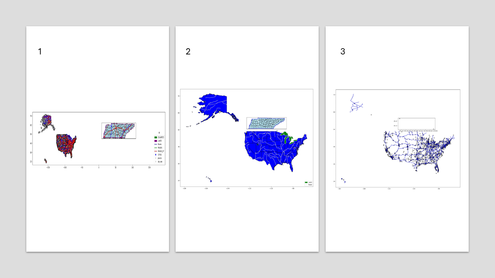

# **Adv. GIS Project**
## **Creating Geospatial Maps with Insets Using Geopandas**
This repository demonstrates using Python's Geopandas and Matplotlib libraries to create geospatial maps with insets. The script allows users to select shapefiles, filter geospatial data based on attributes, and generate maps with inset views to zoom in on specific areas.
This tool addresses:

 - **Customizability:** Interactive selection of shapefiles and data filtering.
- **Efficiency:** Automated map generation, including legends and clipping.
- **Accessibility:** Leveraging open-source tools to make professional-grade geospatial visualization accessible to everyone.

### **Why Geospatial Visualization Matters**
Maps are not just tools for representation—they're analytical interfaces that transform raw data into actionable insights.

**Challenges in Standard Maps:**
  - Overcrowded layers obscure meaningful insights.
  - Lack of focus on critical areas.
  - Difficulty in representing spatial hierarchies.

**Insets solve these challenges by:**
  - Highlighting areas of interest without losing the broader context.
  - Allowing multi-layered analysis in a single visualization.
  - Offering detailed zoom-ins alongside comprehensive overviews.

---

### **Key Features:**
  - Dynamic Shapefile Handling
  - Attribute Filtering
  - Visualizing Multi-Layered Maps
  - Inset Clipping

---

### **Code Structure:**
This code is mainly structured within 4 defined modular functions allowing the tool to be interactive, flexible, and reusable.

1. **list_shapefiles():** Scans directories for shapefiles.
2. **get_user_shapefile():** Handles user input for selecting shapefiles.
3. **get_attribute_filter():** Enables filtering of geospatial data.
4. **create_inset_map():** The core function for plotting main maps with inset visualizations.

---

### **Visualization Examples:**

1. **Multi-Layered Map with County-State Inset**
2. **Rivers, Lakes, and States with County-State Inset**
3. **ValueError: Aspect Must Be Positive**
   - Occurs because of incorrect or incomplete geometry
4. **Attribute Error**
   - If your inset attribute selected is not valid information to plot (e.g. HISPANIC POP within the STATE shape) this error will show
  
---

### **Repository:**
Find this code, examples, and other GIS tools and stuff in the following repository:

- [adv. GIS repository](https://github.com/ivanzp14/python_GIS)
