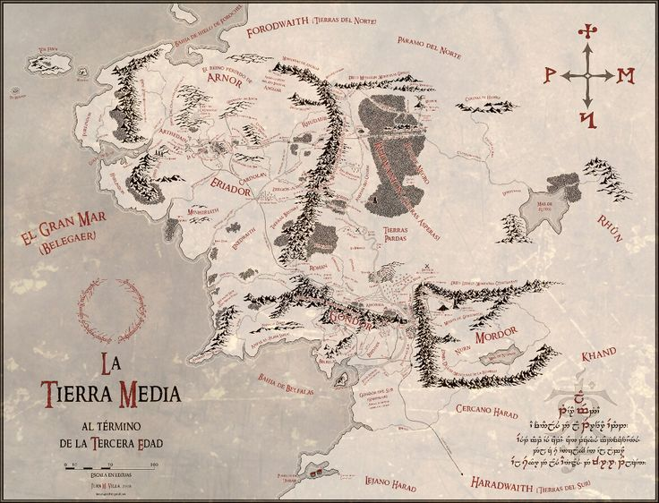

# **Adv. GIS Project**
## **Creating Geospatial Maps with Insets Using Geopandas**
This repository demonstrates using Python's Geopandas and Matplotlib libraries to create geospatial maps with insets. The script allows users to select shapefiles, filter geospatial data based on attributes, and generate maps with inset views to zoom in on specific areas.
This tool addresses:

 - **Customizability:** Interactive selection of shapefiles and data filtering.
- **Efficiency:** Automated map generation, including legends and clipping.
- **Accessibility:** Leveraging open-source tools to make professional-grade geospatial visualization accessible to everyone.

### **Why Geospatial Visualization Matters**
Maps are not just tools for representation—they're analytical interfaces that transform raw data into actionable insights.

**Challenges in Standard Maps:**
  - Overcrowded layers obscure meaningful insights.
  - Lack of focus on critical areas.
  - Difficulty in representing spatial hierarchies.

**Insets solve these challenges by:**
  - Highlighting areas of interest without losing the broader context.
  - Allowing multi-layered analysis in a single visualization.
  - Offering detailed zoom-ins alongside comprehensive overviews.

---

### **Key Features:**
  - Dynamic Shapefile Handling
  - Attribute Filtering
  - Visualizing Multi-Layered Maps
  - Inset Clipping

---

### **Code Structure:**
This code is mainly structured within 4 defined modular functions allowing the tool to be interactive, flexible, and reusable.

1. **list_shapefiles():** Scans directories for shapefiles.
2. **get_user_shapefile():** Handles user input for selecting shapefiles.
3. **get_attribute_filter():** Enables filtering of geospatial data.
4. **create_inset_map():** The core function for plotting main maps with inset visualizations.

```python
import geopandas as gpd  # For working with geospatial data
import os  # For file and directory management
import matplotlib.pyplot as plt  # For creating plots
import matplotlib.patches as mpatches  # For creating polygon legends
import matplotlib.lines as mlines  # For creating line and point legends

# Path to the folder containing the shapefiles
gdb_path = r'C:\Users\zmrplaza\OneDrive - The University of Memphis\Classes\Adv. GIS\Archivos\Oct24\USA'

# Function to list all shapefiles (.shp) in a directory and its subdirectories
def list_shapefiles(gdb_path):
    shapefiles = []
    for root, dirs, files in os.walk(gdb_path):  # Walk through all directories and files
        for file in files:  # Check each file
            if file.lower().endswith('.shp'):  # If the file is a shapefile, add it to the list
                shapefiles.append(os.path.join(root, file))  
    return shapefiles

# Function to let the user select shapefiles for plotting
def get_user_shapefile(shapefiles, prompt):
    while True:
        # Display the prompt and list all shapefiles
        print(prompt)
        for idx, shp in enumerate(shapefiles, start=1):
            print(f'{idx}: {os.path.basename(shp)}')  # Show the index and filename

        # Allow multiple shapefiles for the main plot
        if "main plot" in prompt: 
            choices = input("Enter the numbers of the shapefiles (comma-separated, e.g., 1,3,5): ")
            choices = [x.strip() for x in choices.split(",")]  # Split input into a list
            
            # Validate user input
            valid_choices = []
            for choice in choices:
                if choice.isdigit() and 1 <= int(choice) <= len(shapefiles):  # Check if input is valid
                    valid_choices.append(int(choice) - 1)  # Convert to index
                else:
                    print(f"Invalid choice: {choice}. Please enter valid numbers.")
                    break  # Exit loop if invalid input
            else:
                # Return the selected shapefiles as a list of paths
                return [shapefiles[choice] for choice in valid_choices]
        
        # Right now for the inset, this code allows only one shapefile
        else:
            choice = input("Enter the number of the shapefile: ")
            if choice.isdigit() and 1 <= int(choice) <= len(shapefiles):  # Check if the user's choice is a digit and within the valid range of shapefiles
                return shapefiles[int(choice) - 1]  # Return the selected shapefile path
            else:
                print(f"Invalid choice: {choice}. Please enter a valid number.")

# Function to filter a GeoDataFrame based on an attribute
def get_attribute_filter(gdf):
    while True:
        print("Available attributes:")  # Display available columns in the GeoDataFrame
        for idx, column in enumerate(gdf.columns, start=1):
            print(f'{idx}: {column}')  # Show index and column name
        
        # Prompt the user to enter the number corresponding to the attribute they want to filter by
        attr_choice = input("Enter the number of the attribute to filter by: ")
  
        # Check if the input is a digit and within the valid range of attribute indices
        if attr_choice.isdigit() and 1 <= int(attr_choice) <= len(gdf.columns):  # Validate input
            # Retrieve the name of the chosen attribute column based on user input
            attr_name = gdf.columns[int(attr_choice) - 1]  # Get the chosen column name

            # Display unique values in the chosen column
            unique_values = gdf[attr_name].unique()
            print(f"Unique values in '{attr_name}': {unique_values}")

            # Ask the user for a value to filter by
            attr_value = input(f"Enter the value to filter by in '{attr_name}': ")
            # Return a filtered GeoDataFrame based on the specified attribute value
            # The filtering checks if the attribute (attr_name) contains the given value (attr_value)
            # The search is case-insensitive and ignores NaN values
            return gdf[gdf[attr_name].str.contains(attr_value, case=False, na=False)]
        else:
            print(f"Invalid choice: {attr_choice}. Please enter a valid number.")

# Function to create a map with an inset
def create_inset_map(main_gdfs, inset_gdf, ax, inset_position=[0.5, 0.5, 0.3, 0.3]):
    # Create an inset axes on the main plot
    ax_inset = ax.inset_axes(inset_position)
    
    # Dictionary to store legend handles for different geometry types
    legend_handles = {
        'Polygon': [],
        'LineString': [],
        'Point': []
    }

    # Define colors for the layers
    colors = ['lightgray', 'blue', 'green', 'red', 'purple'] 
    for i, main_gdf in enumerate(main_gdfs):  # Loop through each main GeoDataFrame
        geom_type = main_gdf.geometry.geom_type.unique()[0]  # Get the geometry type
        
        # Plot on the main axes
        main_gdf.plot(ax=ax, color=colors[i % len(colors)], edgecolor='black', legend=True)
        
        # Clip the main GeoDataFrame with the inset GeoDataFrame
        clipped_main_gdf = gpd.clip(main_gdf, inset_gdf)  
        # Plot the clipped main GeoDataFrame on the inset map
        # Use the specified axis (ax_inset) for plotting
        # Set the color using a cyclic index based on the colors list
        # Use black for the edge color of the geometries
        clipped_main_gdf.plot(ax=ax_inset, color=colors[i % len(colors)], edgecolor='black')
        
        # Create legend entries based on geometry type
        # Check if the geometry type is 'Polygon'
        if geom_type == 'Polygon':
            # Create a patch for the polygon with the corresponding color and label
            patch = mpatches.Patch(color=colors[i % len(colors)], label=os.path.basename(main_shapefiles[i]).split('.')[0])
            # Append the patch to the legend handles for polygons
            legend_handles['Polygon'].append(patch)
        # Check if the geometry type is 'LineString'
        elif geom_type == 'LineString':
            # Create a line object for the line string with the corresponding color and label
            line = mlines.Line2D([], [], color=colors[i % len(colors)], label=os.path.basename(main_shapefiles[i]).split('.')[0])
            # Append the line object to the legend handles for line strings
            legend_handles['LineString'].append(line)
        # Check if the geometry type is 'Point'
        elif geom_type == 'Point':
            # Create a marker for the point with the corresponding color and label
            marker = mlines.Line2D([], [], color=colors[i % len(colors)], marker='o', linestyle='None', label=os.path.basename(main_shapefiles[i]).split('.')[0]) 
            # Append the marker to the legend handles for points
            legend_handles['Point'].append(marker)

        # Plot the inset GeoDataFrame
    inset_geom_type = inset_gdf.geometry.geom_type.unique()[0]  # Get the unique geometry type of the inset GeoDataFrame
    if inset_geom_type == 'Point':  # Check if the geometry type is 'Point'
        # Plot the points in the inset with a red color and specified marker size
        inset_gdf.plot(ax=ax_inset, color='red', markersize=50, label=os.path.basename(inset_shapefile).split('.')[0]) 
    else:
        # Plot other geometry types in the inset with a light blue color and black edges
        inset_gdf.plot(ax=ax_inset, color='lightblue', edgecolor='black', label=os.path.basename(inset_shapefile).split('.')[0])  

    # Remove ticks from the inset map
    ax_inset.set_xticks([])
    ax_inset.set_yticks([])

    # Add legend to the main plot
    legend_elements = []
    for geom_type, handles in legend_handles.items():
        if handles:  # Only add legend entries if there are handles
            legend_elements.extend(handles)
    
    ax.legend(handles=legend_elements, loc="lower right")

# Main execution

# List all shapefiles in the directory
shapefiles = list_shapefiles(gdb_path)

# Let the user select shapefiles for the main plot and inset
main_shapefiles = get_user_shapefile(shapefiles, "Select the shapefile(s) for the main plot:")
inset_shapefile = get_user_shapefile(shapefiles, "Select the shapefile for the inset:")

# Load the selected shapefiles into GeoDataFrames
main_gdfs = [gpd.read_file(shapefile) for shapefile in main_shapefiles]
inset_gdf = gpd.read_file(inset_shapefile)

# Apply attribute filtering to the inset GeoDataFrame
filtered_inset_gdf = get_attribute_filter(inset_gdf) 

# Create the main plot and inset map
fig, ax = plt.subplots(figsize=(20, 15))
create_inset_map(main_gdfs, filtered_inset_gdf, ax)  
plt.show()

```

---

### **Visualization Examples:**


1. **Multi-Layered Map with County-State Inset**
2. **Rivers, Lakes, and States with County-State Inset**
3. **ValueError: Aspect Must Be Positive**
   - Occurs because of incorrect or incomplete geometry
4. **Attribute Error**
   - If your inset attribute selected is not valid information to plot (e.g. HISPANIC POP within the STATE shape) this error will show
  
---

### **Repository:**
Find this code, examples, and other GIS tools and stuff in the following repository:

- [adv. GIS repository](https://github.com/ivanzp14/python_GIS)
